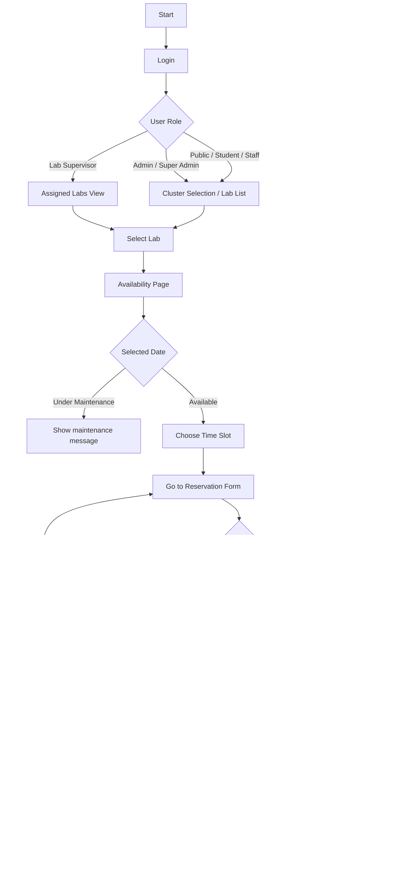
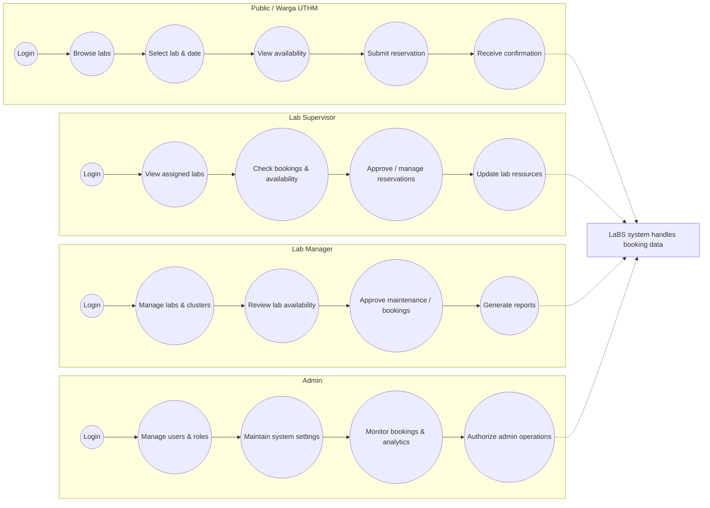
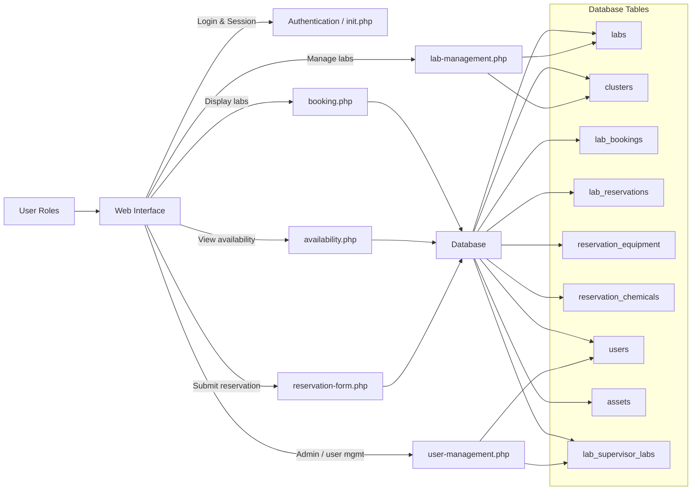
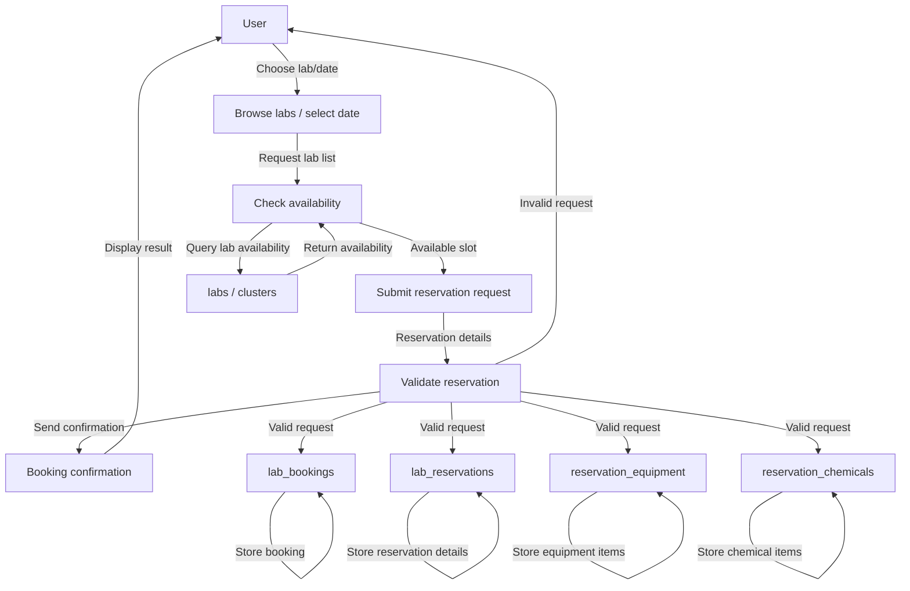
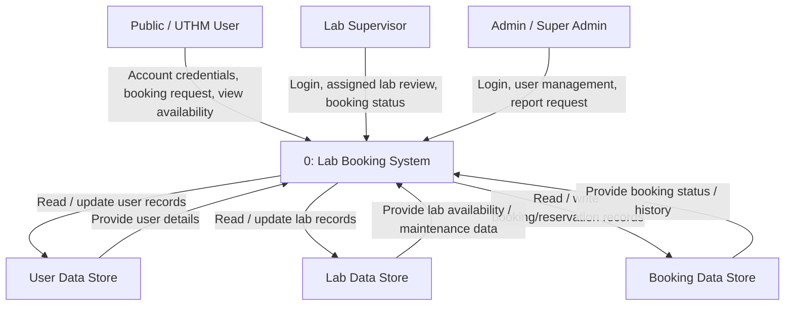
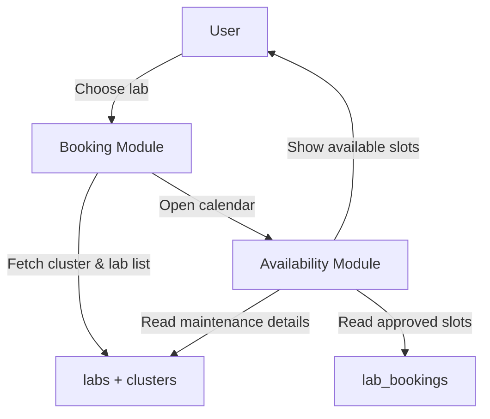
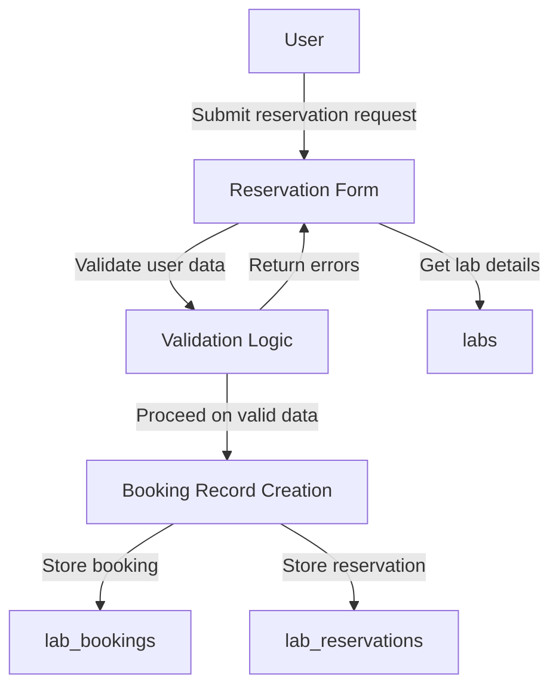
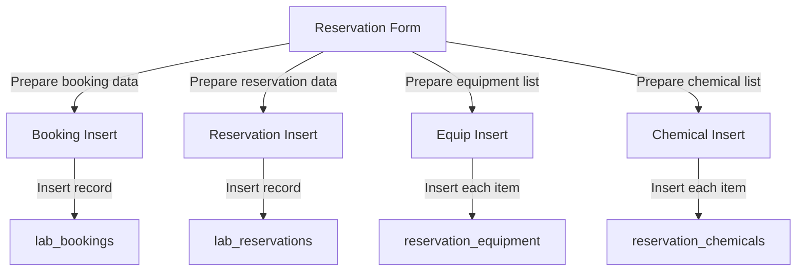

# Lab Booking Project Flowchart and Diagram

## Summary
This new flowchart and diagram reflect the actual reservation and lab booking flow in the project code, especially `booking.php`, `availability.php`, and `reservation-form.php`.

> Note: The attached `.docx` file was not available in the workspace, so direct verification of its diagrams was not possible. These diagrams are created from the project implementation.

---

## System User Types
- `Public User` — external users who can view lab availability and request lab reservations.
- `UTHM Student` — student users who can book labs and may require supervisor information for lab reservations.
- `UTHM Staff` — staff users with broader booking privileges and access to lab reservation features.
- `Cluster Admin` — manages clusters and can view cluster-level lab data.
- `Lab Supervisor` — oversees assigned labs and reviews bookings or manages lab resources.
- `Super Admin` / `Admin` — full system administrators who manage users, labs, clusters, assets, and system settings.

---

## System Modules
- `Booking Module` (`booking.php`) — presents lab selection, assigned labs, and cluster-level lab listings.
- `Availability Module` (`availability.php`) — displays lab calendars, approved time slots, and maintenance windows.
- `Reservation Module` (`reservation-form.php`) — collects booking details, validates the request, and stores reservations.
- `User Management` (`user-management.php`) — manages users, roles, and lab supervisor assignments.
- `Lab Management` (`lab-management.php`, `lab-management-supervisor.php`, `lab-management-cluster.php`) — manages lab records, clusters, and lab supervisors.
- `Asset Management` (`assets-management.php`, `assets-management-lab.php`) — manages lab assets and equipment listings.
- `Reporting / Analytics` (`report-analytics.php`, `super-admin-report-api.php`) — generates system reports and analytics for bookings and lab usage.
- `Profile` (`profile.php`, `profile_api.php`) — manages user profiles and personal details.
- `Authentication` (`index.php`, `logout.php`, `check_admin.php`) — handles login, session control, and access restrictions.

---

## User Reservation Flow



---

## Role-based User Activity Flowchart

Use the Mermaid code below in a Mermaid renderer (VS Code Mermaid preview, Mermaid Live Editor, or other Mermaid tools) to generate a diagram image.



---

## System Component Diagram



---

## Context Diagram (CD)

```mermaid
flowchart LR
    Admin[Administrator]
    Public[Public / UTHM User]
    Supervisor[Lab Supervisor]
    Manager[Lab Manager]
    System[Lab Booking System (LaBS)]
    Auth[Authentication / Session]
    DB[Database]

    Admin -->|Login, manage users/roles, review booking status, generate reports| System
    Public -->|Register/login, view lab availability, request bookings, view booking status| System
    Supervisor -->|Login, view assigned labs, review bookings, manage lab details| System
    Manager -->|Login, manage labs/clusters, approve maintenance, monitor lab status| System

    System -->|Authenticate/session| Auth
    System -->|Store/retrieve booking data| DB
    System -->|Store/retrieve user data| DB
    System -->|Store/retrieve lab data| DB
    System -->|Generate report data| DB
```

---

## Data Flow Diagram (DFD)



---

## DFD Levels

### Level 0 — Top-Level Booking System


### Level 1 — Booking and Availability


### Level 1 — Reservation Form Process


### Level 2 — Reservation Record Creation


---

## Key Process Details

- `booking.php` shows available labs by cluster, or assigned labs for supervisors.
- `availability.php` shows a lab calendar with approved booked time slots and maintenance windows.
- `reservation-form.php` validates all input, protects against maintenance conflicts, and stores:
  - `lab_bookings`
  - `lab_reservations`
  - `reservation_equipment`
  - `reservation_chemicals`
- The form has two booking purposes:
  - `class` booking: requires course code, subject name, class section; no equipment/chemicals; UTHM affiliation assumed.
  - `lab` reservation: requires title and activity details; optional equipment/chemicals; student bookings may require supervisor contact.

---

## Recommended Alignment Notes

- If the `.docx` flowchart shows a simple "select lab → book" path, it should also include the maintenance check and purpose-specific validation.
- If it does not include separate handling for `class` vs `lab` bookings, add that branch.
- If it does not include `reservation_equipment` / `reservation_chemicals` as separate insertion points, that is missing from the actual project flow.

---

## Use
Open `project-flowchart-and-diagram.md` in VS Code to view the Mermaid diagrams and compare them to your document.
